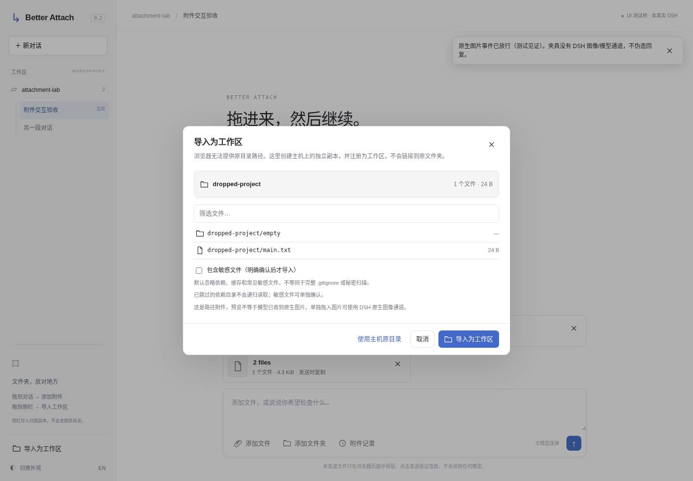

<div align="center">
<h1>Better Attach</h1>
<p>文件夹拖进对话，是附件；拖进侧栏，是工作区。</p>
<p><b>DeepSeek Harness 插件 · 0.2.0-rc.1 · MIT</b></p>
<p><a href="README.md">English</a> · 简体中文</p>
</div>



*实际 UI 测试夹具截图，不是原生 DSH 截图。截图对应内存页面＋本地 HTTP 测试桥；文件真实落盘，工作区注册表为测试替身。*

**Better Attach 不是又一个“官方不能传文件”的插件。** 当前官方主干已经支持普通文件。这里解决的是更具体的事：拖到哪里、导入什么、何时复制，以及出错以后如何继续。

## 同一个拖拽动作，两个明确的结果

| 操作 | 结果 |
| --- | --- |
| 文件或文件夹拖入对话区域 | 先检查、再暂存；发送序列化时才复制，保留目录结构 |
| 一个文件夹拖入左侧栏 | 检查后创建主机上的独立副本，再注册为工作区 |
| 选择“使用主机原目录” | 明确输入运行 DSH 的主机绝对路径，只注册，不上传、不复制 |
| 单独拖入 PNG / JPEG / WebP / GIF | 不拦截事件，继续交给 DSH 原生图片入口 |
| 打开“附件记录” | 查看文件、预览、下载、再次附加已保存批次，不重复创建副本 |

浏览器不能随意提供原目录的绝对路径。因此这里不会搜索同名目录来假装命中，也不会把“导入副本”写成“打开原目录”。图片和普通文件混合导入时是**路径附件**；能看到预览不代表模型自动收到了原生视觉输入。

## 先在本地直接试用

演示和核心测试只需 Node.js 22.16+，没有第三方运行依赖。装入 DSH 时还必须满足**所用 DSH 自身的 Node 版本要求**；不能拿演示最低版本当成 DSH 兼容认证。

```bash
# 在源码目录内。不需要 npm install，也不需要 pnpm。
npm run check
npm run demo
```

打开 `http://127.0.0.1:4173`。演示中的上传会真实写入系统临时目录，**不会调用模型**。Windows 可运行 `START-DEMO.cmd`；macOS/Linux 可执行 `sh START-DEMO.sh`。终端按 Ctrl+C 停止。

[截图步骤演示](docs/assets/walkthrough.gif) · [实际验收结果](docs/ACCEPTANCE.md) · [实现说明](docs/ARCHITECTURE.md)

## 安装这个候选版本

> **尚未完成原生 DSH 实机认证。** 本版是依据公开接口开发、执行了核心与浏览器夹具测试的候选实现，不是“已完整拉取原仓库并在真实 DSH 全链路验证”的保证。先看[兼容说明](docs/COMPATIBILITY.md)和[来源说明](docs/PROVENANCE.md)。请在独立测试配置中安装，不要与旧版或其他接管普通文件拖放的插件同时加载。

产品名是 **Better Attach**；npm 包名保持 **`dsh-multimedia-webui-input`**；仓库仍是 `LCYLYM/dsh-attachments`。不擅自换成已经被其他项目使用的包名，也不假设占有新的 npm 名称。

```bash
# 换成解压后的绝对路径，在测试用 DSH 环境执行。
dsh plugin --profile web add /absolute/path/to/better-attach
dsh --profile web --dump-config
dsh --profile web
```

`install.sh` / `install.ps1` 是同一条本地安装命令的封装，不改 DSH 编译产物。卸载：

```bash
dsh plugin --profile web remove dsh-multimedia-webui-input
```

随后重启主机并刷新网页。卸载不会删除已保存的附件；“附件记录”里的显式清理只删除本插件当前对话的 v2 副本，不动原文件、导入工作区或旧版附件。

## 已实现的体验

**文件夹是一个整体。** 一个文件夹对应一张草稿卡片，内部可筛选浏览；目录拖入接口能够枚举到的空目录会保留。选择文件夹的浏览器兜底入口看不到空目录，这一点不隐瞒。默认跳过 `.git`、`node_modules`、缓存目录及常见敏感文件名；跳过项可查看，敏感文件有明确勾选确认。这不是完整 `.gitignore` 引擎，也不是内容级秘密扫描器。

**预览有边界。** 常用栅格图片可预览，文本和代码最多展示前 128 KiB。HTML、SVG 只作为文本，不放到可执行 iframe 里；PDF、Office、压缩包等格式提供下载，不假装内置了解析器。长文件名仍可查看全名；文件列表先渲染 150 条匹配项，再按需展开。

**失败可以继续。** 两路原始字节上传、进度、取消和重试；同一次选择复用批次 ID，重试跳过已完成文件。主机核对实际字节数与 SHA-256，文件齐全后才提交。附件已落盘与消息已被模型接收是两个不同状态。

**不拆原生界面。** 通过公开 slot 和引用序列化接入，不替换原生工作区列表；不通过全量 `setDraft` 改写别的插件引用；不抢文本拖拽、内部重排或纯图片拖放。包含键盘焦点、减少动态效果、暗色变量兜底和窄屏适配。

## 测试究竟跑到了哪里

| 层次 | 本次结果 |
| --- | --- |
| 核心、真实 HTTP/文件系统、输入/主机接口及可逆覆盖 | **58 项通过**，Linux / Node 22.16.0 |
| Chromium UI | **20 项通过**，明确使用内存页面＋本地 HTTP 测试桥 |
| 该次 UI 执行的未捕获异常 | **0** |
| 原生 DSH 启动、真实模型发送、Finder/Explorer 手工拖拽 | **未执行** |
| Windows/macOS 实机、提供的 GitHub Actions | **未在本环境执行** |

环境中的浏览器被管理策略禁止页面导航；没有修改该策略。测试把同一套 UI 代码载入内存，通过受限的本地测试桥连接真实 HTTP 服务。桥里的 XHR 外形适配层**不能算原生浏览器传输验收**；原始 Node HTTP 与文件写入另有实际测试。脚本默认模式可在正常本地浏览器中直接访问演示服务。

```bash
npm test
# 可选的浏览器开发测试依赖；插件和演示不需要它。
python -m pip install playwright==1.57.0
python -m playwright install chromium
python tests/browser_tests.py --chromium /path/to/chromium
```

真实 DSH 验证清单位于 `artifacts/live-dsh.template.json`。实际测试后再填准确版本、提交号与去敏证据，执行 `npm run release:check`。没有实机证据时该检查会有意失败，不把夹具成功冒充兼容认证。本次没有替你推送 GitHub、发布 npm 或向市场提交。

## 当前边界

候选版 HTTP 接口**只接受回环访问**。公开的 DSH webServer 路由接口本身没有替所有扩展端点建立统一认证规则，不能凭空声称继承了登录权限。本候选版不支持远程浏览器或公开反向代理部署。

未发送的 File 选择只存在当前页面；刷新后需要重新选择。已保存副本可在重启后从“附件记录”查看并再次附加。本版没有把原生聊天历史气泡全部替换成自定义文件卡片，也没有迁移旧版附件数据库。

限制为每批 10,000 文件、20,000 总条目、64 层路径、单文件 1 GiB、总量 2 GiB。这些是准入上限，**不是已经跑过相同规模的性能承诺**。未提交暂存超过 24 小时后，由每小时清理任务处理；已提交数据不自动删除。

[安全](SECURITY.md) · [竞品研究](docs/RESEARCH.md) · [市场收录](docs/MARKETPLACES.md) · [产品决策](docs/DECISIONS.md) · [更新记录](CHANGELOG.md)

## 放回原仓库，不丢 Git 历史

交付压缩包不伪造 Git 历史。覆盖脚本默认只预览，实际写入前创建相邻备份；保留 `.git` 和本包没有包含的原文件：

```bash
node scripts/overlay.mjs /path/to/your/dsh-attachments
node scripts/overlay.mjs /path/to/your/dsh-attachments --apply
# 输出中会给出精确的 --restore 备份路径。
```

随后检查 `git diff`、运行测试、完成原生验证再发布。交互规范参考了 [Emil Kowalski 的 skills](https://github.com/emilkowalski/skills)，没有把其技能源码或字体文件冒充本项目资产。
